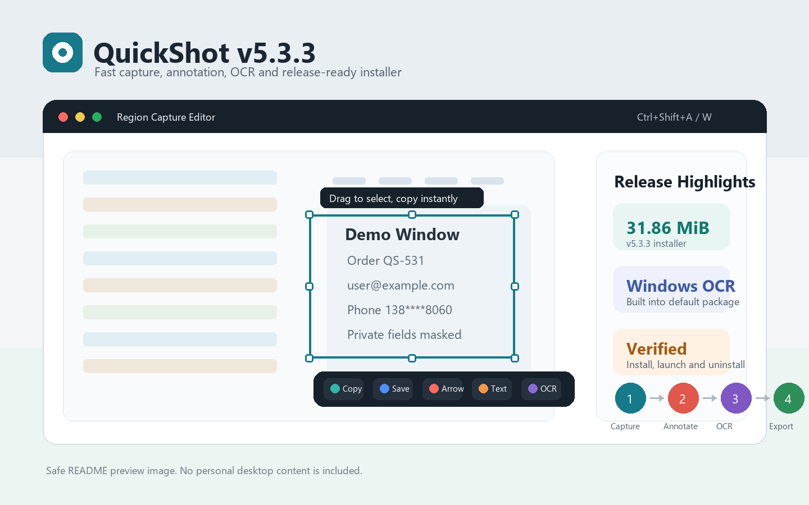

# QuickShot V5.3.3

[](https://github.com/599495053/quickshot/actions/workflows/ci.yml)
[](https://github.com/599495053/quickshot/releases/latest)
[](https://github.com/599495053/quickshot/releases/latest)
[](LICENSE)

QuickShot 是一款 Windows 截图工具，支持区域截图、当前窗口截图、标注、贴图、OCR、翻译、历史库、自动上传、复制、保存、托盘和设置管理。v5.3.3 继续缩小默认安装包，并把 HDR 高级捕获组件改为可选安装。



## 立即下载

| 项目 | 链接 |
| --- | --- |
| 最新版本 | [QuickShot v5.3.3](https://github.com/599495053/quickshot/releases/tag/v5.3.3) |
| Windows 安装包 | [QuickShot-5.3.3-Setup.exe](https://github.com/599495053/quickshot/releases/download/v5.3.3/QuickShot-5.3.3-Setup.exe) |
| 校验清单 | [QuickShot-5.3.3-release.txt](https://github.com/599495053/quickshot/releases/download/v5.3.3/QuickShot-5.3.3-release.txt) |

安装包 SHA256：

```text
738845DC1F9F086E3FDBFC0E70A5DEC9E9D8A12400937040464E998446196F8C
```

下载后可用 PowerShell 校验：

```powershell
Get-FileHash .\QuickShot-5.3.3-Setup.exe -Algorithm SHA256
```

说明：

- 当前发布版未配置代码签名证书，Windows 可能显示安全提示。确认来源是本仓库 Release 后继续安装即可。
- 默认安装不会创建桌面快捷方式，也不会添加开机启动项。
- 默认包保留 Windows 系统 OCR；智能隐私打码会在缺少 RapidOCR 时自动回退到系统 OCR。
- 默认包不捆绑 NumPy、OpenBLAS、dxcam 或 WinRT HDR 捕获组件；普通截图走轻量 `mss` 后端。
- 安全与漏洞反馈请看 [SECURITY.md](SECURITY.md)。

## 快速上手

1. 下载并运行 `QuickShot-5.3.3-Setup.exe`。
2. 启动 QuickShot 后，它会常驻系统托盘。
3. 按 `Ctrl+Shift+A` 拖拽区域截图。
4. 按 `Ctrl+Shift+W` 截取当前窗口。
5. 在编辑层中复制、保存、标注、OCR 或完成截图。

## 常用快捷键

### 全局快捷键

| 快捷键 | 功能 |
| --- | --- |
| `Ctrl+Shift+A` | 区域截图 |
| `Ctrl+Shift+W` | 当前窗口截图 |

### 编辑模式快捷键

| 快捷键 | 功能 |
| --- | --- |
| `A` | 箭头 |
| `R` | 矩形 |
| `U` | 椭圆 |
| `D` | 虚线框 |
| `B` | 画笔 |
| `H` | 高亮 |
| `T` | 文字 |
| `N` | 序号 |
| `M` | 马赛克 |
| `L` | 模糊打码 |
| `O` | OCR 识别 |
| `I` | 取色器 |
| `G` | 网格辅助 |
| `Tab` | 切换上一个工具 |
| 方向键 | 微调选区，按住 `Shift` 每次移动 10px |
| `Ctrl+C` | 复制 |
| `Ctrl+S` | 保存 |
| `Ctrl+Z` | 撤销 |
| `Ctrl+Y` | 重做 |
| `Enter` | 完成 |
| `Esc` | 取消 |

## 主要功能

### 截图

- 高清区域截图和当前窗口截图。
- DPI 缩放适配和轻量 HDR 色调修正；安装可选 HDR 组件后可启用更精确的 HDR 捕获。
- 延迟截图，0-10 秒可配置。
- 选区自动吸附窗口边缘。
- 支持键盘微调选区位置和尺寸。

### 标注

- 箭头、矩形、椭圆、虚线框、画笔、高亮。
- 文字、序号、马赛克、模糊打码、取色器。
- 标注颜色、线宽和样式预设。
- 智能隐私打码可使用默认系统 OCR；安装 RapidOCR 可选组件后会优先使用本地 RapidOCR 引擎。

### OCR 与翻译

- 默认使用 Windows 系统 OCR。
- OCR 结果支持清洗、复制、导出 CSV、导出 Markdown 表格。
- 支持提取数字、提取中文、翻译 OCR 结果。
- 截图完成后可自动 OCR 并写入剪贴板。

### 历史库与贴图

- 自动保存截图历史。
- 支持搜索、收藏、批量删除、复制、导出和重新编辑。
- 可从截图创建贴图窗口。
- 贴图支持缩放、翻转、透明度、锁定、置顶、重命名和管理。

### 截图后工作流

- 截图完成后可自动上传到本地归档或 GitHub 仓库。
- 上传成功后可自动复制 Markdown 链接。
- GitHub Personal Access Token 通过系统凭据管理器保存。

## 可选 RapidOCR 组件

默认发布包不再捆绑 RapidOCR 和 ONNX Runtime。智能隐私打码在轻量包中会自动使用 Windows 系统 OCR；需要本地 RapidOCR 引擎或更稳定的隐私区域检测时，可以在源码/自定义环境中安装：

```powershell
pip install -e .[ocr]
```

## 可选 HDR 捕获组件

默认发布包使用 `mss` 截图后端，不再捆绑 NumPy/OpenBLAS、dxcam 和 WinRT HDR 捕获组件。需要源码/自定义环境里的高级 HDR 捕获路径时，可以安装：

```powershell
pip install -e .[hdr]
```

## 从源码运行

推荐 Python 3.10 及以上。

```powershell
pip install -e .
python launcher.py
```

也可以使用模块入口：

```powershell
python -m quickshot
```

## 反馈与安全

- Bug 报告：[创建 Bug issue](https://github.com/599495053/quickshot/issues/new?template=bug_report.yml)
- 功能建议：[创建 Feature issue](https://github.com/599495053/quickshot/issues/new?template=feature_request.yml)
- 截图、OCR、智能隐私打码、保存、贴图或上传失败时，提示会引导复制诊断信息；也可从托盘菜单或设置页点击“复制诊断信息”，检查后再粘贴到 issue 中。
- 安全问题：请先阅读 [SECURITY.md](SECURITY.md)，不要在公开 issue 中贴敏感截图、token 或个人信息。

## 测试

提交前建议运行：

```powershell
python -m pyflakes quickshot launcher.py build_config.py
python -m compileall -q quickshot launcher.py build_config.py
python -m pytest -q
```

当前验证规模：

- `497 passed`
- `37 subtests passed`

## 打包与发布

构建可执行文件和安装包：

```powershell
powershell -ExecutionPolicy Bypass -File .\scripts\release.ps1 -SkipInstall -Clean
```

发布脚本会自动执行：

- 版本号一致性检查
- `pyflakes`
- `compileall`
- `pytest`
- PyInstaller 打包
- Inno Setup 安装包构建
- exe 和安装包 SHA256 计算
- exe 和安装包 Authenticode 签名状态记录
- release manifest 生成

输出文件：

- `dist\QuickShot.exe`
- `installer_output\QuickShot-5.3.3-Setup.exe`
- `installer_output\QuickShot-5.3.3-release.txt`

打包后冒烟测试：

```powershell
powershell -ExecutionPolicy Bypass -File .\scripts\release.ps1 -SkipBuild -SkipInstaller -SmokeTest
```

本地安装包验证：

```powershell
powershell -ExecutionPolicy Bypass -File .\scripts\verify-local-installer.ps1
```

升级/重装验证：

```powershell
powershell -ExecutionPolicy Bypass -File .\scripts\verify-upgrade-installer.ps1
```

如果本地保留了旧版安装包，可以同时验证旧版升级到当前版：

```powershell
powershell -ExecutionPolicy Bypass -File .\scripts\verify-upgrade-installer.ps1 `
  -PreviousInstallerPath .\installer_output\QuickShot-5.3.2-Setup.exe `
  -PreviousVersion 5.3.2
```

GitHub Release 下载版安装器验证：

```powershell
powershell -ExecutionPolicy Bypass -File .\scripts\verify-release-installer.ps1 `
  -Tag v5.3.3 `
  -ExpectedSha256 738845DC1F9F086E3FDBFC0E70A5DEC9E9D8A12400937040464E998446196F8C
```

本机桌面托盘/全局热键验证：

```powershell
powershell -ExecutionPolicy Bypass -File .\scripts\verify-desktop-hotkeys.ps1 -StopExisting
```

## 代码签名

发布脚本支持使用 Windows SignTool 对 `QuickShot.exe` 和安装包签名。没有证书时不要传 `-Sign`，现有构建流程不受影响。

发布清单会记录 `ExecutableSignatureStatus` 和 `InstallerSignatureStatus`。当前未签名版本应显示 `NotSigned`；签名发布时两项都应为 `Valid`。

单独检查当前产物签名状态：

```powershell
powershell -ExecutionPolicy Bypass -File .\scripts\verify-artifact-signature.ps1 `
  .\dist\QuickShot.exe `
  .\installer_output\QuickShot-5.3.3-Setup.exe
```

签名发布前强制要求有效签名：

```powershell
powershell -ExecutionPolicy Bypass -File .\scripts\verify-artifact-signature.ps1 `
  .\dist\QuickShot.exe `
  .\installer_output\QuickShot-5.3.3-Setup.exe `
  -RequireSigned
```

使用证书存储中的代码签名证书：

```powershell
powershell -ExecutionPolicy Bypass -File .\scripts\release.ps1 -SkipInstall -Clean -Sign -CertificateThumbprint <thumbprint>
```

使用 `.pfx` / `.p12` 证书文件：

```powershell
$env:QUICKSHOT_SIGNING_PASSWORD = "<certificate-password>"
powershell -ExecutionPolicy Bypass -File .\scripts\release.ps1 -SkipInstall -Clean -Sign -CertificateFile C:\path\to\certificate.pfx
```

## 安装包行为

安装包由 Inno Setup 6 构建，脚本为 `QuickShot.iss`。

默认安装行为：

- 不创建桌面快捷方式。
- 不添加开机启动。
- 支持简体中文安装界面。
- 卸载时会尝试关闭正在运行的 QuickShot。

## 项目结构

| 路径 | 说明 |
| --- | --- |
| `launcher.py` | 标准源码入口 |
| `quickshot/` | 应用源码 |
| `tests/` | 自动化测试 |
| `QuickShot.spec` | PyInstaller 配置 |
| `QuickShot.iss` | Inno Setup 安装包配置 |
| `scripts/release.ps1` | 发布构建脚本 |
| `scripts/verify-local-installer.ps1` | 本地安装包验证 |
| `scripts/verify-upgrade-installer.ps1` | 升级和同版本重装验证 |
| `scripts/verify-release-installer.ps1` | GitHub Release 安装包验证 |
| `scripts/verify-artifact-signature.ps1` | exe 和安装包 Authenticode 签名状态验证 |
| `scripts/verify-desktop-hotkeys.ps1` | 本机桌面托盘和全局热键验证 |

## 发布状态

v5.3.3 已完成以下验证：

- 本地 release build 通过。
- packaged smoke test 通过。
- 本地安装包验证通过。
- 5.3.2 -> 5.3.3 升级覆盖和 5.3.3 同版本重装验证通过。
- 区域截图和当前窗口截图已在发布桌面自动验证。
- GitHub Release 下载版安装器验证通过。
- CI 通过。
